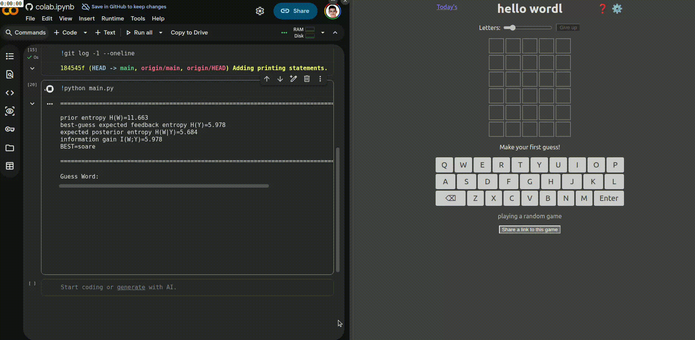

# Wordle Solver

A lightweight Wordle solver that uses information theory to choose the best next guess.

## What it does

- loads the allowed Wordle guesses and possible target words
- computes feedback patterns for each guess/answer pair
- encodes Wordle feedback as a base-3 integer pattern
- evaluates candidate guesses by expected information gain
- iteratively narrows the remaining answer set until the word is found or the game ends

## Demo



## Run it

```bash
python main.py
```

The program prompts for a guess and feedback each round, then recommends the next best move.

## Files

- [main.py](main.py) — solver logic and game loop
- [data/dictionary_5_letter.json](data/dictionary_5_letter.json) — valid guesses
- [data/targets_5_letter.json](data/targets_5_letter.json) — valid answer words
- [docs/problem_statement.pdf](docs/problem_statement.pdf) — assignment specification

## Notes

This project follows the Wordle duplicate-letter rule and evaluates guesses using entropy-based decision making rather than a simple word-frequency heuristic.
